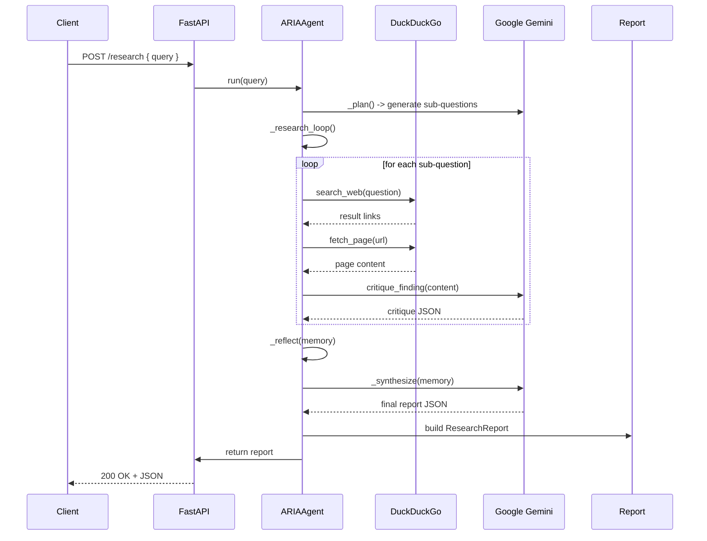
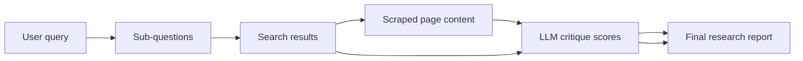

# ARIA Agent

ARIA Agent is a lightweight research assistant built with FastAPI, Google Gemini, and DuckDuckGo search. It converts a single research query into a multi-step investigation, gathers live web evidence, evaluates each source, and synthesizes a structured research report.

---

## 🚀 What ARIA Agent Does

ARIA Agent is designed around a simple research workflow:

1. **Plan**: Turn a user query into 3-5 sub-questions using Gemini.
2. **Research**: Search the web for each sub-question and fetch top result content.
3. **Critique**: Ask Gemini to evaluate each finding for relevance, accuracy, confidence, and gaps.
4. **Synthesize**: Generate a final JSON research report from the strongest findings.

This creates a more robust research pipeline than a single search or single prompt.

---

## 🧠 Core Components

### `app/main.py`
- Creates the FastAPI application.
- Loads environment variables from `app/.env`.
- Builds a `genai.Client` using `GEMINI_API_KEY`.
- Exposes the `/research` POST endpoint.

### `app/agent.py`
- Contains the `ARIAAgent` class.
- Implements the research pipeline with methods:
  - `_plan()` to break down the query into sub-questions.
  - `_research_loop()` to gather and critique results.
  - `_reflect()` to compute average confidence.
  - `_synthesize()` to summarize and structure the final report.
- Returns a `ResearchReport` dataclass object.

### `app/tools.py`
- Handles external data operations:
  - `search_web()` uses `ddgs` to perform DuckDuckGo search.
  - `fetch_page()` scrapes page text for each result.
  - `critique_finding()` asks Gemini to evaluate content quality.

### `app/models.py`
- Defines reusable data structures:
  - `SearchResult`
  - `CritiqueResult`
  - `Finding`
  - `AgentMemory`
  - `ResearchReport`

---

## 🧩 Architecture Overview

`/research` POST request => `ARIAAgent.run()` =>
- `_plan()` generates sub-questions
- `_research_loop()` searches and evaluates each result
- `_reflect()` scores the agent confidence
- `_synthesize()` creates the final JSON report

### Component Diagram

```mermaid
graph TB
    A[Client] -->|POST /research| B[FastAPI app]
    B --> C[ARIAAgent]
    C --> D[_plan()]
    C --> E[_research_loop()]
    C --> F[_reflect()]
    C --> G[_synthesize()]
    E --> H[search_web()]
    E --> I[critique_finding()]
    H --> J[DuckDuckGo search via ddgs]
    H --> K[Web page scrape]
    I --> L[Google Gemini evaluation]
    G --> M[Structured ResearchReport]
    M --> B
    B -->|JSON response| A
```

### Sequence Flow



### Data Flow



The endpoint returns a structured report like:
```json
{
  "summary": "...",
  "key_points": ["..."],
  "contradictions": ["..."],
  "confidence_score": 0.0,
  "sources": ["..."],
  "gaps": ["..."]
}
```

---

## 🛠️ Install & Run

1. Activate the virtual environment.
2. Install dependencies:
```bash
pip install -r requirements.txt
```
3. Start the API server:
```bash
uvicorn app.main:app --reload --port 8000
```

---

## 🔐 Environment Variables

The app expects the following environment variable in `app/.env`:

```env
GEMINI_API_KEY=your_google_gemini_api_key
```

If the API key is missing or invalid, the server will fail during startup.

---

## 🧪 How to Use the API

Send a POST request to:

```http
POST http://localhost:8000/research
```

With a JSON body like:
```json
{
  "query": "What is artificial intelligence?"
}
```

### Recommended testing methods
- FastAPI Swagger UI: `http://localhost:8000/docs`
- curl
- Postman / HTTP client

---

## 💡 Notes

- The agent is intentionally modular: planning, research, critique, and synthesis are separate stages.
- The system uses the Gemini LLM for both planning and evaluation, while DuckDuckGo provides live search signals.
- Because the app loads `app/.env`, the `.env` file must remain in the `app` folder or the path must be updated.

---

## ✅ Why this design matters

Instead of a single prompt call, ARIA Agent uses a multi-step reasoning pattern:
- decoupled planning
- source-level critique
- confidence-aware synthesis

That makes research output more structured and easier to inspect when compared to a single LLM response.

---

## 📌 Quick Start Checklist

- [ ] `pip install -r requirements.txt`
- [ ] Create `app/.env`
- [ ] Set `GEMINI_API_KEY`
- [ ] Run `uvicorn app.main:app --reload --port 8000`
- [ ] Visit `http://localhost:8000/docs`

---

## 🧾 Project Structure

- `app/main.py` — FastAPI entrypoint
- `app/agent.py` — core research pipeline
- `app/tools.py` — search, scrape, and critique helpers
- `app/models.py` — structured data definitions
- `app/.env` — local API key configuration
- `requirements.txt` — Python dependencies
